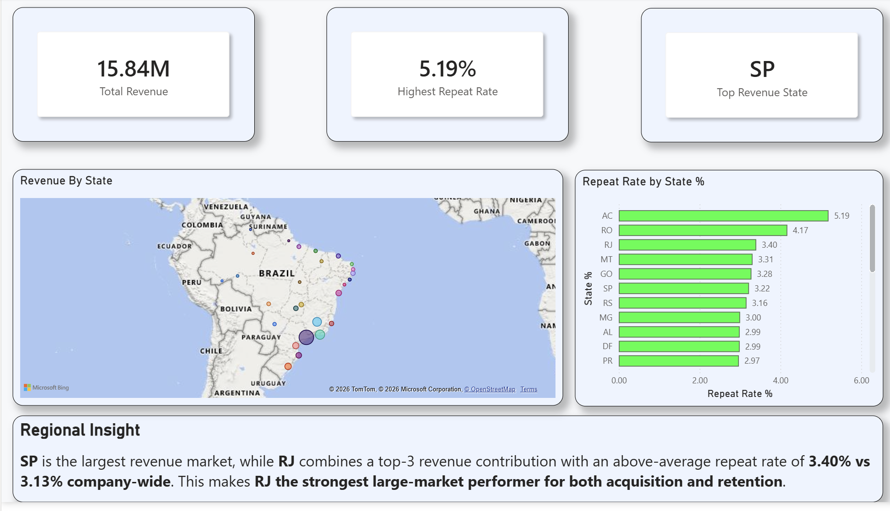
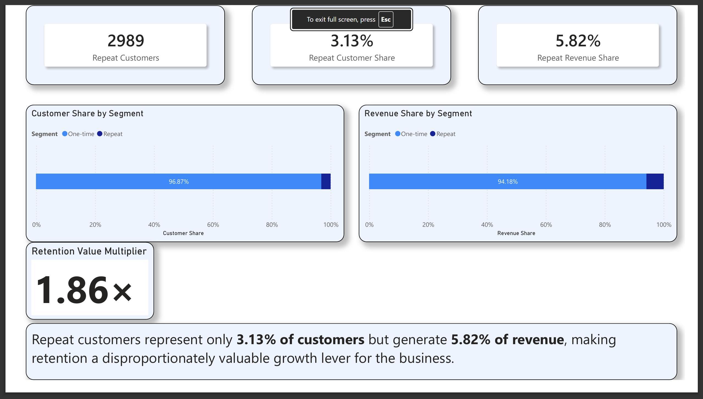
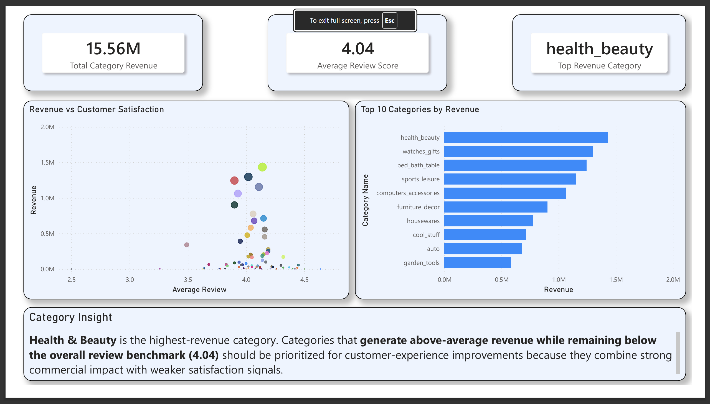
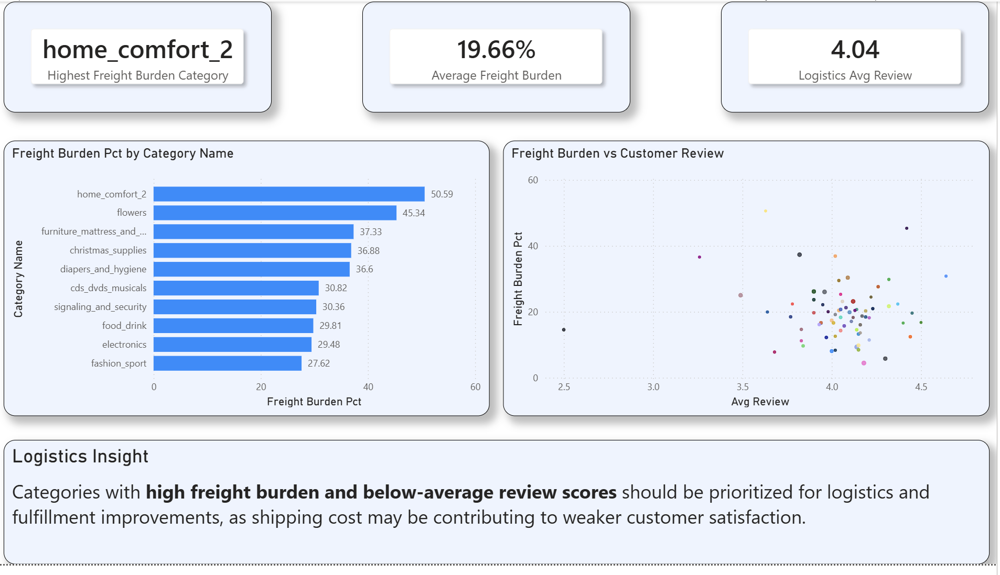

# Olist E-commerce Analytics Dashboard

End-to-end **PostgreSQL + Power BI + DAX** portfolio project analyzing customer behavior, revenue concentration, satisfaction, and logistics efficiency using the **Olist Brazilian e-commerce dataset**.

## Project Overview

This project combines SQL analysis with interactive Power BI reporting to answer four business questions:

- Which states drive the most revenue and retention?
- How valuable are repeat customers?
- Which categories combine high revenue with weaker customer satisfaction?
- Which categories suffer from the highest logistics burden?

## Dataset

- **Source:** Olist Brazilian E-commerce Public Dataset
- **Customers:** 95k+
- **Revenue analyzed:** 15.5M+
- **Tools:** PostgreSQL, Power BI, DAX

---

## Dashboard Pages

### 1. Regional Performance

- São Paulo is the largest revenue market.
- Rio de Janeiro combines strong revenue contribution with above-average repeat rate.

---

### 2. Retention Value Summary

**Key finding**

- Repeat customers: **3.13% of customers**
- Repeat customer revenue: **5.82% of revenue**
- Value multiplier: **1.86×**

This suggests retention is a disproportionately valuable growth lever.

---

### 3. Category Satisfaction vs Revenue

- Health & Beauty is the highest-revenue category.
- Categories with **above-average revenue but below-average review scores** should be prioritized for customer-experience improvements.

---

### 4. Logistics Burden Analysis

- Home Comfort 2 shows the highest freight burden.
- High freight burden combined with lower review scores may indicate fulfillment and shipping friction.

---

## SQL Highlights

- Common Table Expressions (CTEs)
- Window functions
- Revenue share calculations
- Repeat customer segmentation
- Category-level aggregation
- Freight burden analysis

---

## Power BI Highlights

- KPI cards
- Bubble map
- 100% stacked bar charts
- Scatter plots
- Executive insight boxes
- DAX measures for shares, benchmarks, and value multipliers

---

## Deliverables

- `Olist_BI_Project.pbix` — Power BI source file
- `Fahad_K_Olist_Ecommerce_Analytics_Dashboard.pdf` — exported portfolio report

---

## What I Learned

- Translating business questions into SQL metrics
- Building reusable DAX measures
- Understanding filter context
- Connecting SQL modeling to dashboard storytelling
- Communicating insights for non-technical stakeholders

---

## Author

**Fahad K**

- LinkedIn: https://www.linkedin.com/in/fahad-k-3508a0218/
